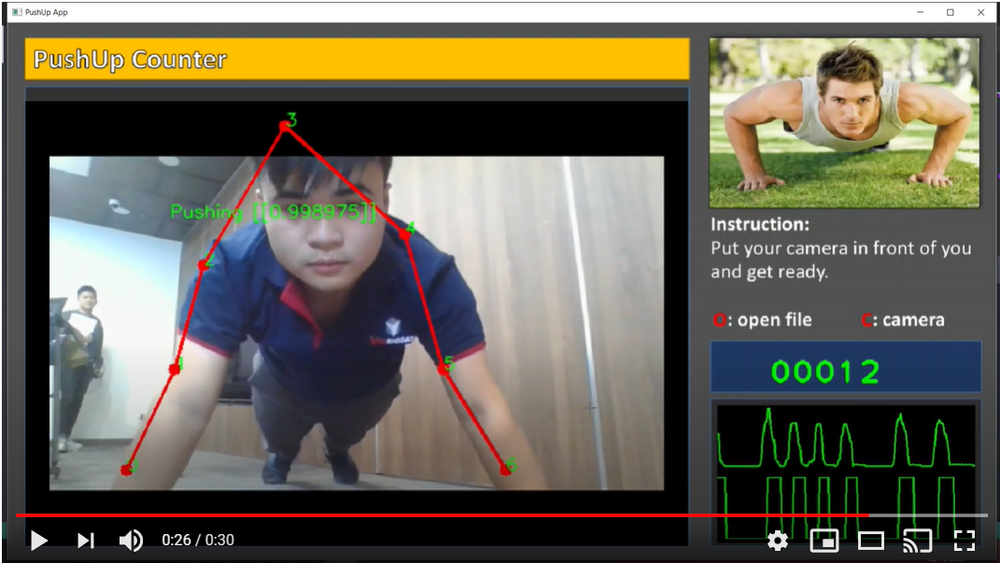

# Pushup Counter App

<a href="https://youtu.be/pm2mGmgwSZo"></a>

## Install

This package requires Python >= 3.7. Install all dependencies using requirements file:

```
pip install -r requirements.txt
```

## Demo

- Download pretrained models [here](https://1drv.ms/u/s!Av71xxzl6mYZgdce9bZZRCr8dZpH_A?e=g3jsf7) and put all models in `/pretrained_models`.

- Edit configuration in `config.py` to update model paths and thresholds.

- Run demo app:

```
python pushup_app.py
```
